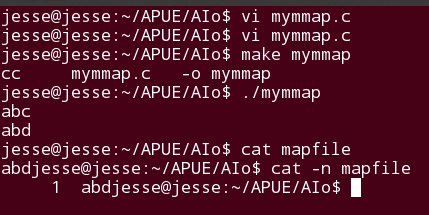
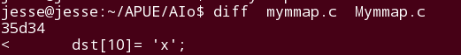
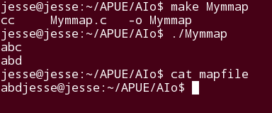
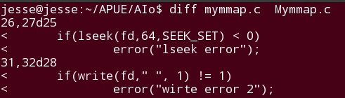
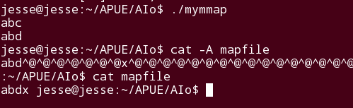

## General

看过一遍内存映射I/O，意思大概是懂了，就是直接操作文件再而直接通过缓冲区来操作，减少一些read、write调用所花费的时间。加上文中给出一个copy的例子，意思也好理解的。   
不过困扰的来了，我琢磨着在映射两个文件后，再使用memcpy内存复制函数将文件写入完全可以，但是这是两个文件的操作，我想一个文件自己对自己的修改呢？只有一个文件的时候，该怎么做呢？于是自己就开始构建一个程序来验证一下。正好也顺手将书后的习题14.11也解决掉:)

## 猜想

首先设想创建一个空文件，先写入一点数据，接着映射到缓冲区区，接着再写一点数据进去。简单说就是open==> write ==> mmap ==> write 但是一想这边根本没有涉及到使用缓冲区，还是建立在文件的操作上，失败！    

继续想一个思路，书上有一句话 **此函数的返回地址是该映射区的返回地址** ，意思就是说mmap的返回值可以拿过来用，我们可以将它的内容输出，我个人猜想这个内容应该就是文件的内容。那么这样我不就可以对这个返回值进行相应的操作，这不就是在对映射的缓存区进行操作吗？    

鉴于书中提到一个函数msync是将映射区的修改同步到文件中，那么对文件的修改也就能体现出来了。一气呵成的想法，最后还有一个释放映射区，这是一个基本的清理操作。大体上应该可以设计了。    

思路整理下，首先是创建文件，写入一点数据，然后映射过去，读映射区的内容(返回值) 修改映射区，同步写入文件，清理工作。这个思路应该差不多了。


## 实现

编码之前的一个问题，mmap的返回值是void \*,  而我们要展示的确是字符串之类的，于是想到得强制转换下这个返回值。这一步解决后，开始编码

```
	#include<stdio.h>
	#include<stdlib.h>
	#include<string.h>
	#include<fcntl.h>
	#include<unistd.h>
	#include<sys/mman.h>
	#include<errno.h>


	static void error(const char *msg)
	{
		fprintf(stderr,"%s:%s\n",msg,strerror(errno));
		exit(1);
	}

	int main(void)
	{
		int		fd;
		char     *dst;

		if((fd = open("mapfile",O_RDWR|O_CREAT|O_TRUNC,0666)) < 0)
			error("open error");

		if(write(fd,"abc",3) != 3)
			error("wirte error");
		/*let this file map to memory area*/
		if((dst =(char *)mmap(0,64,PROT_READ|PROT_WRITE,MAP_SHARED,fd,0)) == MAP_FAILED)
	
		error("mmap error");
		
		close(fd);
		printf("%s\n",dst);
		dst[2]='d';
		printf("%s\n",dst);
		if(msync((void *)dst,64,MS_SYNC) < 0)
			error("msync error");

		if(munmap((void *)dst,64) < 0)
			error("munmap error");

		return 0;

		}
```

初期的一个编码大概是这样的，运行后的结果还是比较不错的.



细究下这个代码，我尝试的是去改已经写入的内容，这个确实有一个修改的意思了，看来对返回值的猜想是正确的，对返回值的修改就是对这个映射区的修改。同时，我也测试了将文件描述符关闭后，缓存区是不受影响的，照样可以操作，并且是能够同步到文件中的。这点确实很关键。   

可我并不觉着这样就可以了，我的目的是继续往里面写数据，就像一开始想的那样，在映射后我还需要将其他数据写入， 看看这个是否是和write函数一样可以做到这一点。   

修改代码



我们一开始只是写入了3个，而给的缓存区是64的，足够再写入的。但是运行的结果



和上面的一样，没有任何的改变。。。 按照道理来时应该会有一个x出现的。

看书，发现书上的copy函数的例子中，有一个偏移的设置，书中也有个说法**映射文件的启示偏移量受系统虚存页的限制，如果映射区的长度不是页的整数倍，任何的变动，都不会再文件中反映出来，不能用mmap将数据添加到文件中，需要加长该文件** 也就是说我这边需要一个偏移，看书上的copy的例子，上面是从文件开始偏移了inputfile的长度。也就是说现在这个文件从开始到偏移的位置有一个空洞，那么再映射过去后，显示的量应该就是能满足了，这样就可以将所更改的写入到文件中。回到我刚才的那个，虽然映射区是给64,但是文件的长度不足，这和write不一样，write可以直接接着后面写。所以必须文件的大小要满足才行。   

继续修改代码

  

此刻运行的结果就符合我的猜想了，下面是结果的运行 



可以看到，cat输出了我刚刚插入的一个'x',继而看文件的真实情况，也完全符合我的猜想，在第十一位放入了一个x，至于为什么输出的还是三个，因为字符串的结尾有一个'\0'则'x'没有连在一起。    


其实还有一个细节，再形成文件空洞的时候，不仅仅是要偏移位置，还需要写入一个字符，来标识这个文件真实长度，否则结果和不使用偏移一样文件的长度还是原来的大小，并没有被扩充。    
 
有一个不错的方法使用ftruncate，直接设置文件的大小，省却使用lseek和write的繁杂。


## 总结

mmap再IPC中提及到，但是在APUE中涉及了这个，这让我想起了再做摄像头驱动的时候，使用过这个函数，但是一点概念一点都没有，完全跟着老师后一个字一个字的敲，现在大概能理解使用存储映射的过程，至于什么二级缓存，一级缓存，感觉需要到实际项目中才能感受到。

（全文完）

			

