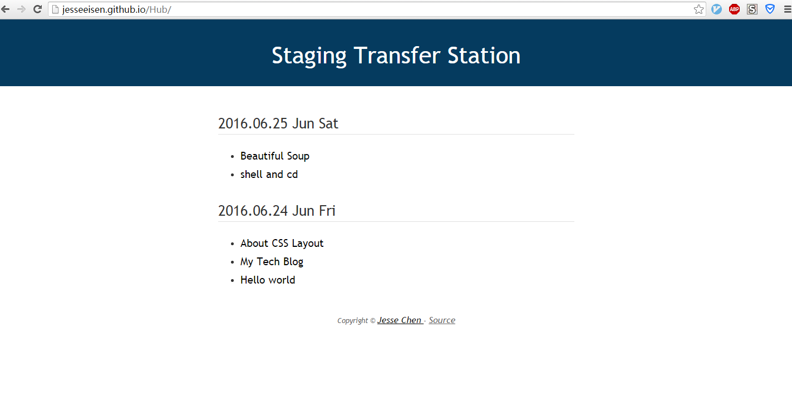

## Reason
在日常的工作中，当去查某一个问题的时候，往往会在搜索过程中，找到一些其他的链接。这个链接与我的目标没有太多的关系，但是出于好奇，我会点开。这样会造成一个问题，随着你查找问题的深入，这个`搜索栈`会变的很深。

一般会有如下的做法：

+ 直接`ctrl + d` 搜藏该网页，然后关掉
+ 或者添加到`pocket`中
+ 或者`剪藏`到相应的笔记应用中

针对第一个做法：时间一长，即使有一个好的整理习惯，当再次打开某些收藏夹的时候，也许要找上一段时间，或者有时基本找不到搜藏的链接。对于第二和第三个做法，利用插件直接将当前网页直接保存下来。对于pocket而言，提供了一些分类的功能，使用上还算是可以。但是唯一不太能接受的是界面，每个放进去的链接都有一个缩略图放在旁边，但是有些网页并没有图片，所以整体的体验就不太好了。另外，pocket会对网页进行一个自己的排版，有时候这个转换是好的，有时候则不行。而对于印象笔记的剪藏，这个痛点在于：剪藏下来的网页，保存在笔记中会显得有点乱，需要整理，且在笔记的页面显示中并不是很好。

让我动手写这个工具的一个很重要原因：在公司看到的一些不错的链接，回去想继续看一下时，由于我不想让chrome同步历史记录，因为这样会比较混乱。所以这个方式行不通。如果将这些保存到稍后阅读软件中或者笔记应用中话，时间一长，堆积多了，以后整理的过程也会比较麻烦。

所以一个简单而且有不乱的搜藏就显得很有必要了，这个想法在我每次下班的时候尤为的强烈。将那些只是有兴趣，但此时没有空看的网页和链接保存到文件中，并实现同步即可。目前的效果图如下：



## Thought
这个工具的功能实质上非常的简单，说白了，就是将网页和网页的简单描述放到一个文件中。只是省去了打开文件，粘贴内容，保存的过程。

我最想解决的是同步问题，之前有快盘，在家和公司的电脑上可以轻松的同步文件，这样我个人的一些积累和笔记便可以轻松同步。这个是一个非常好的节奏。但是快盘挂了。所以这个便利就需要自己来实现了。

最直接的方式就是`github`。但是仅仅同步了还是不够的，如果要查看，需要点进repo中，然后打开文件，复制链接，然后打开。 这一系列的操作比之前还要麻烦，但是github提供了gh-pages。这就解决了这些问题，将内容直接展现在网页上。这样一方面方便浏览，随时随地打开网页便可看。 如果界面内容又很简洁，只有该链接相关的描述信息的话，找到这个链接的速度会更快。

## Implenment

### Html Page

我想要的是一个非常简洁的页面，所以写这样一个html页面，并不是复杂。`header`、`content`、`footer` 这三段即可。 content里面只要一个二级标题和一个列表。
每个二级标题代表某一天的搜藏(主要就是一个时间)，列表展示的是收藏的链接的内容。

这样的页面实现，对后面的添加提供了一个便利。具体的页面实现没有什么好说的，纯css就可以搞定。只是在link上做了一个小的效果，不然就太过于单调了。

### Command Line Tool

这个命令行的工具，功能也是很明确的。

+ 添加某一个链接(li)
+ 添加某一天的列表(ul)
+ 推送到github上

我是将最新的放在页面最上方，也就是说只要在`content`这个`div`的下方添加即可，这样让实现变得非常的简单。以插入一个列表为例：

```html
<div class="content">
```

只要找到第一个`content`出现的地方，获取到行号，然后使用`sed`将文本插入进去。

```shell
function CreateNewDay()
{
    LineNo=`grep -n content index.html |head -1|cut -b 1,2`
    sed -i "${LineNo} a${1}" index.html   # h2 tag
    let LineNo=LineNo+1
    sed -i "${LineNo} a${2}" index.html   # link item
    let LineNo=LineNo+1
    sed -i "${LineNo} a${3}" index.html   # </ul> tag
}
```
上面的代码很简单，就不多解释了。 而链接的添加则和列表一样，找到第一个`h2`标签即可。

最后推送到github便是最常见的一些操作了，实现自动提交，只需要你在clone的时候使用ssh方式。
不然使用https的方式需要每次输入用户名和密码。

当这一天的第一次使用时，只要用`gatherUrl -n "page describe" "url"` 便创建了今天的list。如果你还有其他的链接想添加进去。使用`gatherUrl -i "page describe" "url"` 便将这个url添加到今天的list中。每天下班前，使用`gatherUrl -u "xxxx"` 其中`xxx`是用于提交的comment。(当然随时都可以提交) 这样回到家，只要打开网页，页面最上面便是今天的添加。省去了不少的事儿。

使用前还有一个简单的设置，可以去看看这个[工具](https://github.com/JesseEisen/Hub)的README。

## More

还有一些功能是可以添加上去，比如：按主题自动归档一些链接等。 还有的等在使用的时候发现那些不顺手，不断的改进。

> 欢迎前往 https://github.com/JesseEisen/Hub 试用，一起改进这个小工具。

(全文完)


