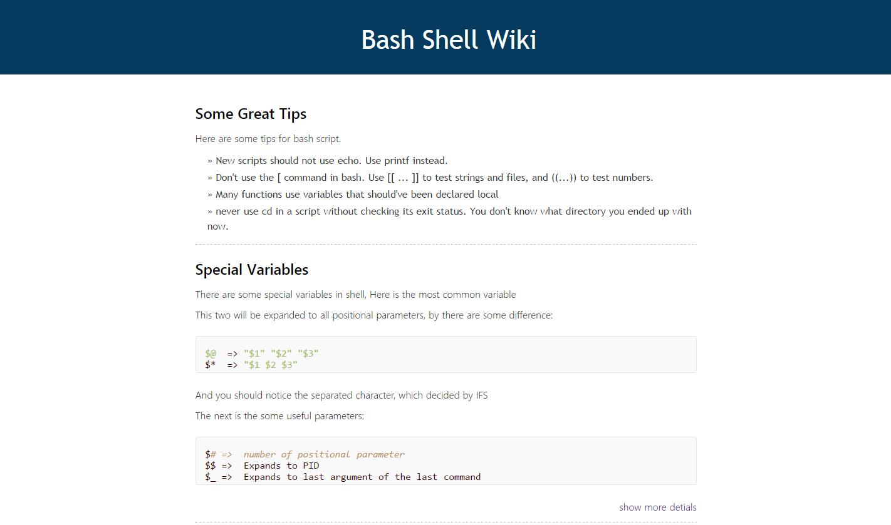
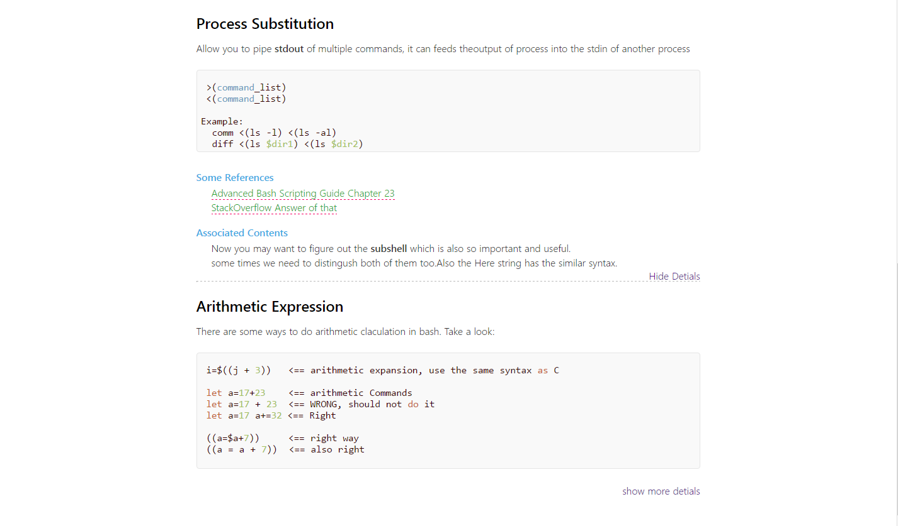

## Motivation
个人的工作和学习中经常会遇到不少的问题，此时我们会去网上各种搜索，找到自己想要的答案。但是有时候搜索的是一些固定的知识点。比如：Lua的字符串操作函数/ruby的case语句如何写/bash shell的变量扩展，等等这些。 这些内容往往在学该门语言时都有涉及。如果当时做了笔记，我们也许不需要再去网上搜索，直接搜索自己的笔记。如果自己有一个好的笔记系统的话，这些问题，也许会在很短时间内就可以得到答案。有时我们会去搜索一些并不是这些既定的知识，而是有一些灵活的内容时。当看到这个链接下的内容比较不错，一种选择是直接收藏这个链接到指定的分类中，另一个选择是直接将网页剪藏下来，保存到对应的笔记应用之中。

上面的这两个情况基本上是平时在编程或者学习时的最常用的姿势。但是这些需要一个好的习惯，每次记了一个笔记，需要及时的将这个笔记整理分类。如果没有一个很好的细分的话，笔记一多，在检索的时候同样比较头疼。每当我们收藏了一个链接，则需要我们进行一个分类，同样这个分类不够细化的话，时间一长，同样这个分类下就变成了一个灾难。

说了这么多，并不是说这些方式不行，我一直都是这么干的。但是很多时候会发现，这么干我会做很多无用功，重复着之前干过的事儿。所以建立一个自己的wiki系统，有什么问题直接到指定的分类下去搜索，减少很多漫无目的的搜索。这个做法也可以说是，通过wiki强制自己去整理这些。而不是等一段时间再去整理，过一段时间对我而言意味着不会去整理。

所以最近我琢磨着自己搞一个wiki的系统，一个界面很简单，内容比较突出的wiki。

## Search
在建立自己的wiki之前，我尝试去搜索过一些wiki的系统。比如[Gollum](https://github.com/gollum/gollum)， 依托于github的构建的一个wiki系统。[基于Git的维基管理：gollum](http://www.yangzhiping.com/tech/gollum.html) 阳志平早在2013年的时候就推荐了，但是所生成的wiki有一定的局限性。
同时我在知乎上也看到类似的提问[有哪些适合个人知识管理的 wiki 系统？](https://www.zhihu.com/question/19716095)这里面也提到了不少。但是我总觉得少点什么。

这些与我脑海中想的有些不一样，于是我就按照自己的想法，尝试着去构建一个简单的个人wiki系统。

## Construction
我的想法很简单，拿Shell来说，shell的一些内容比较古怪，如果一段时间不写，也许你会想不起来一些简单的语法，或者写出来的脚本一直出错。这个时候你也许会去google:`bash + case`, 而这个搜索你也许在之前做过很多次，但是如果现在直接从wiki中搜索，找到case的语法，最直接的呈现在眼前，没有别人写的博客中的那些过多介绍。同时在下方还隐藏着一些相关的知识。比如一些不错的参考链接，这些链接是在你仍然觉得不够，想看看之前自己都看了哪些链接的。同时还提供一些有关case或者是你搜索的那个知识点一些惯用法，好的写法。这样可以更快拿过去用。

这个过程没有很多妨碍的信息，只在你想看的时候才会出现。

## Implementation
界面的设计很简单，一个标题，一段简要说明，外加一个代码框(这是针对于编程语言)，同时一个隐藏展开按钮，暂且将这个部分叫做一个节点。这样的一个节点的隐藏内容里面，可以包括上述说的：`参考链接` 、`惯用法`、`相关内容`等一些模块。

这部分的样式也是比较简单的，主要是突出内容。所以当这个结果确定好后，后面的节点就是依葫芦画瓢的填入相应的内容。

在界面实现好后，考虑到不可能直接用html来书写wiki的内容。需要一个比较方便并且格式简单的方式来书写wiki内容。 考虑使用markdown的方式来写，但是发现我的html样式是自己定制的，通过markdown转换是没有办法达到我的这个效果。(P.S. 如果你有什么好的工具，可以方便的定制markdown希望你能分享一下，非常感谢)。 即使是用`pandoc`也不行，只能定制一些通用的结构的样式，并不能如此的自由定制。

所以我觉得自己仿照markdown的格式做一个简单的样式解析，不需要做到markdown那样可以嵌套解析(如果这样的话，需要实现一个递归下降的语法解析)。 这里面也不需要使用到专业的编译原理的知识。只用将相应的标记转成对应的html代码即可。

在写解析工具之前，我本打算直接用`bash`来实现，因为Linux上有很多的字符串处理和文件处理工具，应该可以很方便的完成这个工作。但是html中的各种标记`< / > " '` 这些字符在某些Linux工具中需要进行转义。简单来说`sed`在处理长的字符串时，需要对内部的这些字符做相应的处理，否则出错的几率相当的大。

处于这个考虑，所以就暂时放弃了这个想法。如果用`C`的话，字符串上的处理函数不是很多，需要自己去实现一些。对于这个工具，显然有点过于重了。最终我选择了`ruby`。
但是对ruby只接触了一个星期，但是对这个语言甚是喜欢。纯OOP，写法上方式很多，所以就拿这个语言来实现这个解析转换的小工具。

写法很古板，`if-elsif-else` 外加一个类。 感觉这不是`ruby`的风格。所以就不在这边贴代码了，实在拿不出手。不过这个工具还是可以正确的满足现阶段的要求。 写的过程很顺畅，这也让我对ruby有了更多的兴趣。很想了解了解ruby元编程的概念。

有点扯远了，下面来简述下这些简单的标记。

## Flag Explain

这些标记还是借鉴了一些markdown的样式，也有一些是为了简单，而特意简化的。方便解析^_^

1.标题

为了统一风格，wiki里面只提供了h1/h3

```
#h1
###h3
```

2.段落

由于段落没有任何特征，所以就强加了一个`>`在行首。以标记这是一个段落。这个在`markdown` 表示为引用

```
> This is a paragraph, long long long long
```

3.代码
代码直接放置在`----` 之间，这个和`markdown`中将代码放置在反引号中类似，也是一个简化的使用

```
----
if [ 1 -gt "$1" ];then
   echo "good"
fi
----
```

4.链接

链接的形式和markdown是一样的，并没有什么特殊，但是不支持嵌套的使用，即不支持列表和链接同时使用。

```
[Google](https://google.com)
```

5.列表

使用`+`来表示列表，目前也只支持无序列表。对于markdown的`-`等也可以表示列表，暂时不支持。

```
+item1
+item2
+item3
```

6.特殊标记

+ Associated
+ Reference
+ Idioms

这三个标记独占一行，用途可以从字面意思看出，这是用在隐藏部分时，`相关内容`、`参考链接` 、`惯用法`项。

+ Show
+ Hide

这两个是标记隐藏部分的开始和结束。

```
====
```

这个标记是用来标记一个节点结束的。这在`markdown`中有时候是用来渲染标题的。

上面的这些标记基本足够使用了。 至于`加粗`和`斜体` 可以在wiki书写时直接加上`<b></b>` `<i></i>`标记。

## Usage

我写了一个小的脚本用来执行这个转换。这个脚本做了一些额外的备份工作，防止由于解析错误后导致整个页面都没有了。

使用也很简单：`./generateHtml  wikifile`

当然了，这个脚本是用bash写的，可以任意的修改。

## Summary
下面贴两张图，第一张是wiki的正常状态：



第二张则是某一个节点展开后的样式




某一类的wiki只是一个页面，这类内容下面的对应的分类，可以在对应的node下面进行更新。再更新完成后，转成html并推送到github上。这样便可以在任何地方进行查看。
不过我也曾考虑过，利用`electron` 制作一个桌面应用，可以实现写完便可以自动转换并直接浏览的功能。这个也就等到以后再去实现了(以后，对于程序员而言不到受不了的时候不会动手^_^)

最后这个项目的地址：[Personal Wiki Repository](https://github.com/JesseEisen/PersonalWiki)

(全文完)
