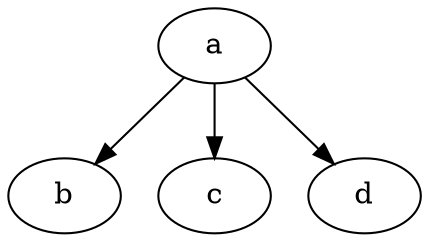
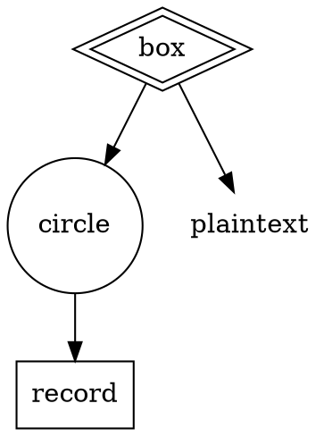

graphviz dot 是一个命令行的绘图工具， dot 主要是用来绘制有向图，最后通过命令行生成对应的图片文件，比如 GIF, PNG, PostScript 等。除了 dot 之外，graphviz 还有其他的绘图命令，比如：neato、twopi 等，这些命令的语法上比较类似，只是最终绘制出来的是不同类型的图形。

### 一. dot 基本内容

dot 文件主要关注三个部分：「图表」、「节点」、「边线」。在这三个点的基础上增加一些属性来达到生成的图更加合理。 一个图可以是有向图(digraph) 或者一个无向图(graph)。节点在名字第一次出现时就被创建，边线则是用 `->` 表示的。 最终我们可以通过以下命令来编译生成相应的图像。

```shell
$ dot -Tps graph.gv -o graph.ps
```

命令中的 `-T` 表示要生成的目标是什么类型。这些类型可以是：

+ -Tps (PostScript)
+ -Tsvg
+ -Tfig
+ -Tpng -Tgif
+ -Timap
+ -Tcmapx

一个最简单的例子展示一下 dot 的基本语法：


编译后生成如下的图

//TODO

### 绘图属性
属性一般是一个键值对，Node 和 Edge 的属性是放在`[]` 中。

### Node 形状

一般 node 大致上分为两类：polygon-based 和 record-based。 后者是用来实现用户自定义的 Node 的。默认的 node 的形状是 `shape=ellipse, width=.75, height=.5`。但是我们可以更改成其他的类型：**box**, **circle**,**record** 和 **plaintext**。

如果 `regular=true` 被设置了，那这个 node 将会被强制变成一个通用的形状。`peripheries` 用来设置当前图形有几个外边框。`orientation` 用于指定多边形的形状的旋转(也可以理解为图形的拉伸)，这个属性只对多边形有作用。如下：



//TODO 图片

**polygon** 这个形状属性可以使用所有的多边形参数，通过这个形状来创建不是预定义的形状。 如果将 shape 定义成 polygon 的话。可以通过 sides 来确定这个多边形有几条边，此外有两个形变的参数： skew 和 distortion。 skew 是水平方向上的形变，取址范围是 [-1.0, 1.0]。distortion 则是垂直方向上的形变，取值范围同上。

skew 可以借助将一个长方形形变成一个平行四边形的方式来理解。 distortion 可以借助将一个长方形形变成一个梯形。 这两个参数都作用于多边形，所以不仅仅是四边形，但是借助四边形可以帮助理解这两个参数的使用。

```
digraph G {
    parallelogram [shape=polygon, size=4, skew=.4];
    isosceles_trapezoid [shape=polygon, size=4, distortion=-0.4];
}
```
上面代码绘制了一个平行四边形和一个等腰梯形。 注意 skew 和 distortion 只作用于多边形，对于 box 而言不起作用。

### Labels

默认的一个 node 的标签就是他的名字， edges 默认是没有标签的。 不过我们可以通过 `label` 属性来指定。多行的 label 可以用 `\n`,`\l`,`\r` 来实现居中，左对齐和右对齐。

对于 graph 和 subgraph 而言也可以有 label 的。 graph 的 label 默认是在中间的。使用 `labelloc=t` 会在 graph 的上面居中显示 label。
Cluster 的 label 是出现在长方形里面的。默认是在左上角。不过可以使用 `labelloc-b` 把 label 移动到长方形的下方。`labeljust=r` 把 label 移动到右边。

默认的字体是 14pt，Times-Roman，黑色。 使用 `fontname`,`fontsize`,`fontcolor` 设置对应的字体。字体的名字最好选择标准通用的字体名。比如： `Times`, `Helvetica`,`Courier` 等。如果 graphviz 没有 fontconfig。可以使用 fontpath 来指定字体文件的路径。如果没有设置的话，dot 会找 `DOTFONTPATH` 这个环境变量，如果这个变量未设置，则使用默认的内置字体。

edge 的 label 是靠近 edge 中间的位置。需要关注的是 label 的溢出。属性 `decorate` 设置为 true 之后，会在 label 和边线之间画一个线。属性`labelfloat=true`， dot 就会采用自适应的方式去画图。

此外对于 edge 的 label 而言，两个比较特殊的属性：`headlabel` 和 `taillabel`  这两个是设置了 edge 开头和结尾的内容，对应参数是要设置的内容。同样 label 也有 `labelfontname`, `labelfontsize`, `labelfontcolor` 这些属性设置样式。 `labelangle` 和 `labeldistance` //TODO


### graph styles

Node 和 edge 可以指定一些外型的属性。上面也提到过了。现在我们详细的了解一下相关的属性。

1. **color**

color 的值可以是内置的颜色名称或者 RGB 值，颜色名称是不区分大小写的。尽量避免使用太多的明亮的颜色。选择一些跨度范围比较小的颜色比较好些。

1. **style**

style 属性可以用来指定图形的多种样式。属性值使用逗号分隔，预定义的值包括：`solid`, `dashed`, `dotted`, `bold`,`invis`。 前面四个控制了在绘制 node 和 edge 的时候边界线条的样式。 invis 会让节点和边线不会显示出来。

此外，还有一些比较好用的属性值：

+ filled    填充, 填充的颜色可已使用 fillcolor 指定。
+ diagonals 在图形的四个角上添加斜线
+ rounded   圆角
