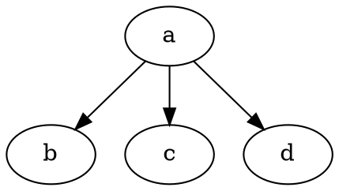
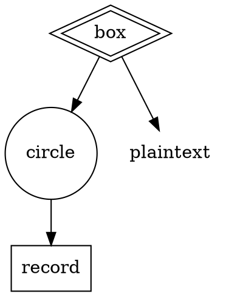

graphviz dot 是一个命令行的绘图工具， dot 主要是用来绘制有向图，最后通过命令行生成对应的图片文件，比如 GIF, PNG, PostScript 等。除了 dot 之外，graphviz 还有其他的绘图命令，比如：neato、twopi 等，这些命令的语法上比较类似，只是最终绘制出来的是不同类型的图形。

### 一. dot 基本内容

dot 文件主要关注三个部分：「图表」、「节点」、「边线」。在这三个点的基础上增加一些属性来达到生成的图更加合理。 一个图可以是有向图(digraph) 或者一个无向图(graph)。节点在名字第一次出现时就被创建，边线则是用 `->` 表示的。 最终我们可以通过以下命令来编译生成相应的图像。

```shell
$ dot -Tps graph.gv -o graph.ps
```

命令中的 `-T` 表示要生成的目标是什么类型。这些类型可以是：

+ -Tps (PostScript)
+ -Tsvg
+ -Tfig
+ -Tpng -Tgif
+ -Timap
+ -Tcmapx

一个最简单的例子展示一下 dot 的基本语法：


编译后生成如下的图

//TODO

### 绘图属性
属性一般是一个键值对，Node 和 Edge 的属性是放在`[]` 中。

### Node 形状

一般 node 大致上分为两类：polygon-based 和 record-based。 后者是用来实现用户自定义的 Node 的。默认的 node 的形状是 `shape=ellipse, width=.75, height=.5`。但是我们可以更改成其他的类型：**box**, **circle**,**record** 和 **plaintext**。

如果 `regular=true` 被设置了，那这个 node 将会被强制变成一个通用的形状。`peripheries` 用来设置当前图形有几个外边框。`orientation` 用于指定多边形的形状的旋转(也可以理解为图形的拉伸)，这个属性只对多边形有作用。如下：



//TODO 图片

**polygon** 这个形状属性可以使用所有的多边形参数，通过这个形状来创建不是预定义的形状。